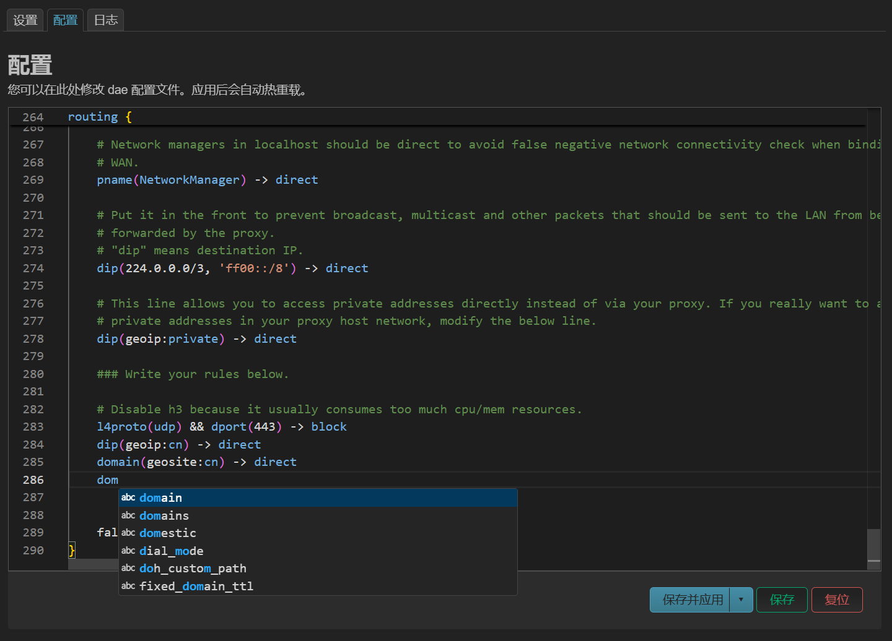
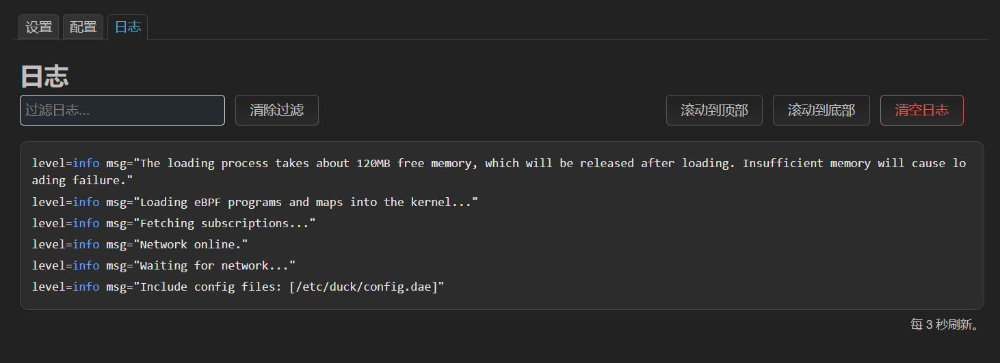

<div align="center">

# InfinityDuck

</div>
<p align="center"></p><br>

This project is based on [luci-app-dae](https://github.com/immortalwrt/luci/tree/master/applications/luci-app-dae), originally maintained by [Tianling Shen](https://github.com/1715173329).

## New Features:
- Latest commit version of dae core
- Powerful config editor provided by monaco-editor
- Simple config file validation
- Reversed log order with scrollbar
- Log highlighting and filtering


## Compilation
1. Install dependencies
```
apt update
apt install -y clang-19 llvm-19
```
2. Enable eBPF support, add below to `.config`:
```
CONFIG_DEVEL=y
CONFIG_KERNEL_DEBUG_INFO=y
CONFIG_KERNEL_DEBUG_INFO_REDUCED=n
CONFIG_KERNEL_DEBUG_INFO_BTF=y
CONFIG_KERNEL_CGROUPS=y
CONFIG_KERNEL_CGROUP_BPF=y
CONFIG_KERNEL_BPF_EVENTS=y
CONFIG_BPF_TOOLCHAIN_HOST=y
CONFIG_KERNEL_XDP_SOCKETS=y
CONFIG_PACKAGE_kmod-xdp-sockets-diag=y
```
3. Build InfinityDuck
```
git clone https://github.com/JohnsonRan/InfinityDuck package/new/InfinityDuck
make package/new/InfinityDuck/luci-app-duck/compile
```
- Or you can try [this](https://github.com/JohnsonRan/opwrt_build_script/releases) prebuilt firmware if you are using **x86_64** or **NanoPi R5S**
## Thanks
- [Percy Ma](https://marketplace.visualstudio.com/items?itemName=kecrily.dae)
- [Tianling Shen](https://github.com/1715173329)
- Claude 3.7 Sonnet  
And more...

## Screenshots
<details>
 <p>
  
  
 </p>
</details>
